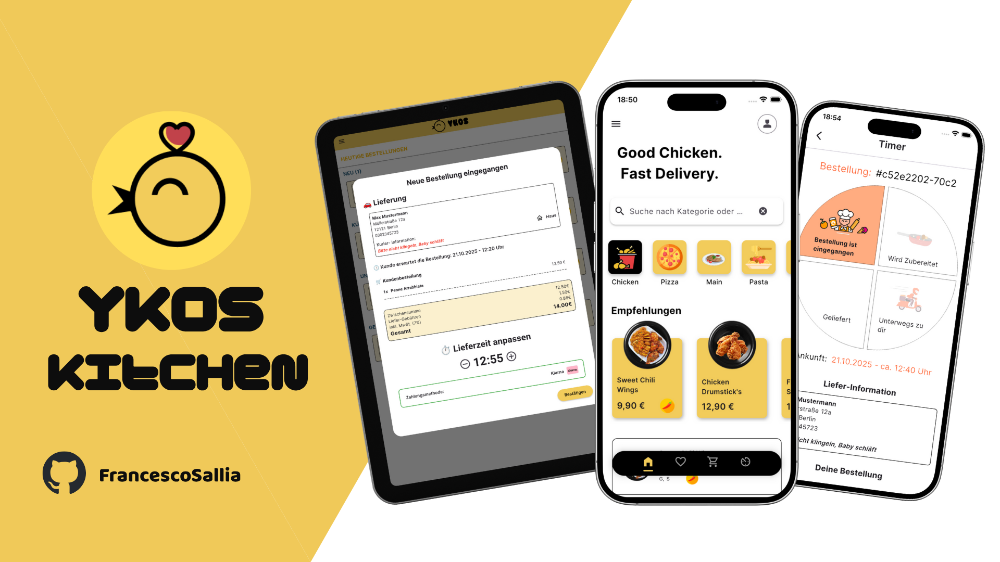
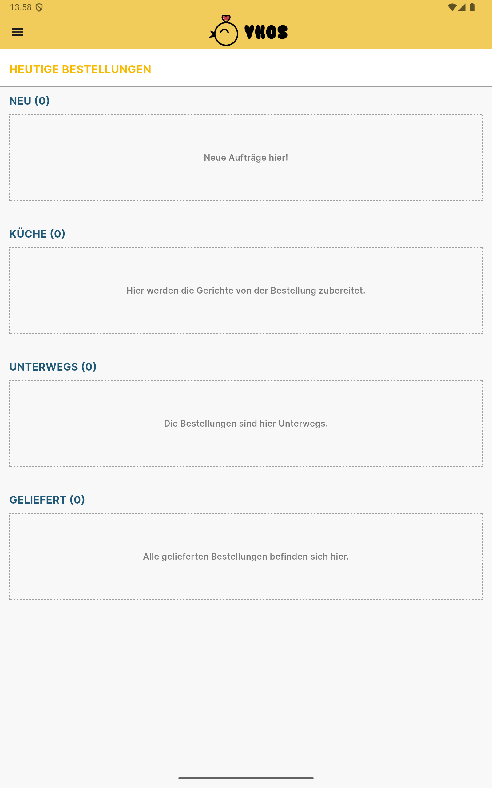
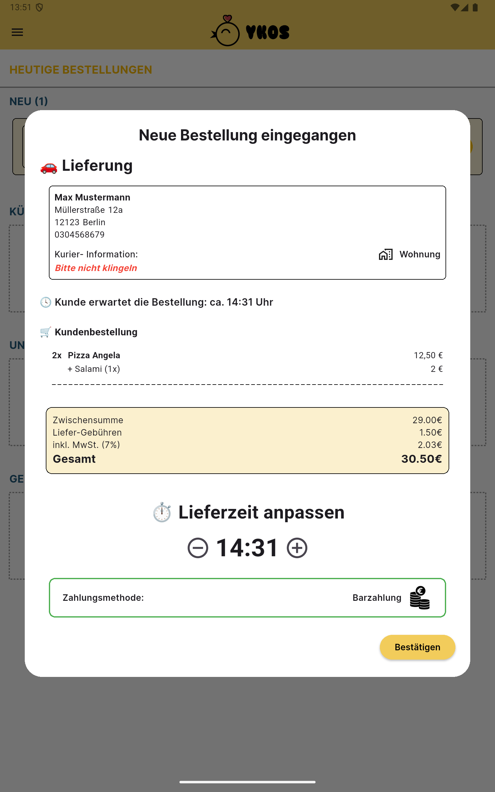
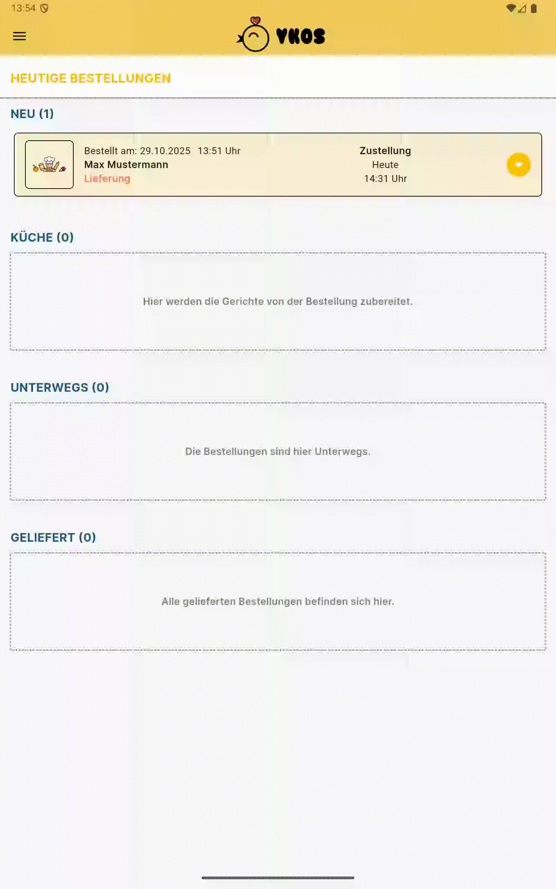

  

---

# 🍳 YKOS Kitchen – Real-Time Restaurant Management

**The digital kitchen companion for YKO’S – where every order is managed live, clearly, and efficiently.**

The **YKOS Kitchen App** is the official back-end management application for the **YKOS BBQ Chicken** customer app.  
It enables restaurant staff to receive, manage, and update orders **in real time** – ensuring perfect synchronization between the kitchen and customers.

Once a customer places an order in the YKOS BBQ Chicken app, it appears **instantly** in the kitchen dashboard of YKOS Kitchen, where staff can update the order status, track timers, and manage delivery or pickup workflows seamlessly.

---

## 🍔 Key Features

- [x] **Real-Time Order Sync** – Direct connection to Cloud Firestore for instant order updates.  
- [x] **Live Order Management** – View, update, and track incoming orders.  
- [x] **Status Control** – Mark orders as *In Progress*, *Ready*, or *Delivered*.  
- [x] **Timer Integration** – Each order has a countdown for preparation tracking.  
- [x] **Authentication System** – Secure login for authorized staff only.  
- [x] **Offline Support** – Orders remain accessible even without a constant internet connection.  
- [x] **Modern UI** – Built with Flutter for speed and simplicity in daily operations.  

---

## 📱 Screenshots & Animations

  
  
  
  

---

## 🔧 Technical Overview

Developed using **Flutter** and structured with the **MVVM pattern (Model-View-ViewModel)**.  
The app uses **Provider** for reactive state management and **Firebase** for data synchronization and authentication.

### 📁 Project Structure

**• Models:**  
Define the main data structures (Order, User, MenuItem) and interact with Firestore.

**• ViewModels:**  
Contain the business logic for managing orders, authentication, and app state.  
Examples:
- `ViewmodelOrders` → Handles order updates, timer logic, and Firestore streams.  
- `ViewmodelFireAuth` → Manages authentication and user sessions.  

**• Views (Pages):**  
Flutter UI screens for kitchen staff, such as login and home (order dashboard).

**• Services:**  
Abstract Firebase operations for cleaner, modular code.  
Example:  
- `FireAuth` → Handles authentication (login, logout, password reset).  

---

## ☁️ Firebase Integration

### Firebase Services Used

- **Firebase Authentication**  
  Used for secure login and access control.  

- **Cloud Firestore**  
  Provides real-time data synchronization between the YKOS Kitchen App and YKOS BBQ Chicken App.  

### Benefits

✅ **Instant synchronization** between customer and kitchen apps  
✅ **Secure user authentication** for kitchen staff  

---

## 🔁 Connection to YKOS BBQ Chicken App

The **YKOS Kitchen App** communicates directly with the **YKOS BBQ Chicken App**.  
When a customer places an order:
1. It is saved in Firestore.  
2. The order appears instantly in the YKOS Kitchen App.  
3. Kitchen staff can:
   - Update order status (e.g., *in progress*, *ready*, *on delivery*).  
   - Adjust preparation or delivery times.  
   - Trigger live updates visible to the customer’s app in real time.  

This ensures smooth coordination and full transparency between kitchen and customer.

---

## 🧪 Testing & Reliability

The app has been tested through unit and integration tests with focus on:
- Firestore synchronization between the two apps.  
- Authentication stability for staff users.  
- Resilience against offline scenarios.  

---

## 🚀 Future Enhancements

- [ ] **Push notifications** for new or updated orders  
- [ ] **Detailed order analytics** and reporting dashboard  
- [ ] **Role-based access control** (e.g., chef, manager, delivery staff)  
- [ ] **Multi-location kitchen management**  
- [ ] **In-app chat** between staff and delivery drivers  

---

## 🧩 Packages & Frameworks

| Technology | Description |
|-------------|--------------|
| **Flutter** | UI framework for Android & iOS |
| **Provider** | State management (MVVM pattern) |
| **FirebaseAuth** | Authentication for kitchen staff |
| **Cloud Firestore** | Real-time order data storage |
| **Google Fonts** | Typography customization |
| **Logger** | Debugging and logging |
| **UUID** | Unique identifiers for orders |

---

### 🏗️ Architecture Summary

| Folder / File | Description |
|----------------|--------------|
| 📂 `model/` | Data models (Order, User, MenuItem) |
| 📂 `viewmodel/` | Business logic & state (Provider) |
| 📂 `service/` | Firebase Services (Auth, Firestore) |
| 📂 `Page/` | UI views (LoginPage, HomePage) |
| 📄 `main.dart` | App entry point |

---

## ❤️ Conclusion

**YKOS Kitchen App** brings full control and transparency to the kitchen workflow.  
It ensures instant communication between the customer-facing and kitchen-facing apps – powered by **Firebase** and **Flutter**.  
Reliable, fast, and intuitive – the digital assistant for every YKO’S chef.
